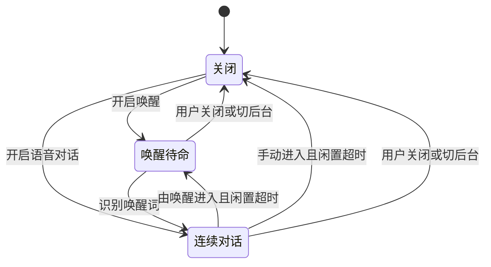

# 对话逻辑分析与优化方案

## 目标

让用户清楚知道应用何时在听、何时在想、何时在说；一次只处理一轮回复；关闭或离开应用后，旧回复不能重新发声。保持现有唤醒词、人设、云台跟随和语音服务接口。

## 原有流程与问题

- 文字输入 → `/chat` → 表情更新 → TTS。
- 萌萌唤醒 → 本地 Sherpa（失败时回退 STT）→ 唤醒事件 → 连续录音 → STT → `/chat` → TTS。
- 语音输入直接调用一次录音；语音对话由 VoiceWakeController 循环录音。两条入口原本可以同时争用麦克风。
- 看一下／带视觉的语音指令 → 释放人脸流 → 拍照 → `/chat/vision` → 恢复人脸流。
- 视觉守望、人脸在场事件、触摸和设备事件也会发起网关请求。

主要问题：

1. VoiceState 同时承担模式和工作阶段。recording 无法说明是唤醒采样还是连续对话，按钮仅比较瞬时状态，容易不能关闭或重复启动。
2. notifyTtsEnded 无条件转入 conversation。普通文字或设备事件播报也会显示连续对话，但并不一定存在录音循环。
3. 多个自动事件共用 busy 标志，却没有统一请求入口保护。旧回复可能覆盖新状态；异常分支可能遗留忙碌或播报标记。
4. 权限检查是异步的，停止操作可能先完成，随后旧启动过程又恢复监听。
5. 本地唤醒的迟到事件可能在播报或对话阶段改变状态。
6. build_messages 原先仅构造 system 和本轮 user 两条消息。现有记忆、情绪状态不等于逐轮对话历史，不能把“连续录音”当成“具备多轮上下文”。
7. 控制面板原先保存状态快照；公网健康检查超时过短；音频字节偏移处理有误。这三项已在此前修复，不再重复引入另一套实现。

## 新的交互约定

| 入口 | 行为 | 结束后的状态 |
|---|---|---|
| 萌萌唤醒 | 开启唤醒待命，识别唤醒词后进入连续对话 | 闲置后回到唤醒待命；关闭则停止 |
| 语音对话 | 不需要唤醒词，直接连续对话 | 闲置后关闭；不会自行开启长期唤醒 |
| 语音输入 | 结束当前语音循环，录入并发送一句 | 回复后保持关闭，避免两个录音器并发 |
| 文字输入 | 发送一轮文字，按设置播报 | 保留原有语音模式，不因播报建立新会话 |
| 看一下 | 明确的一次拍照问答 | 恢复原人脸流；不变更语音模式 |
| 视觉守望 | 在场状态监测 | 主动对话、录音、播报期间不抢答；不积压过期自动事件 |
| 关闭对话／关闭唤醒 | 停止监听和播放，使未完成回复失效 | 关闭 |
| 切后台／开启隐私 | 停止相关输入，使旧网关回复失效 | 不自动重新开启 |

模式与阶段分开：

录音 → 识别 → 请求 → 播报是模式内的工作步骤，不再决定模式按钮是否开启。

## 第一阶段：模式与生命周期（已实现）

- 新增稳定的 VoiceMode，控制按钮不再依赖 recording/speaking 等瞬时状态；关闭按钮在请求期间仍可使用。
- 普通播报结束回到既有模式；手动连续对话与唤醒进入的对话采用不同闲置退出路径。
- 启动前建立运行代次，权限请求返回后检查是否已被停止；停止及时变为关闭。
- 只在唤醒模式且没有播报时接受唤醒事件，忽略其他阶段的迟到事件。
- 单次语音输入先停止循环监听；本地人脸在场事件不抢占主动对话。
- 网关回复入口一次只接受一轮处理，忙碌标记覆盖该轮播报并在 finally 中释放；移除重复网关包装函数。
- 会话代次使关闭、后台和隐私模式之前的旧回复失效；这不等于取消服务器已收到的 HTTP 请求。
- 播报异常也清理 speaking 状态；网络失败不再一律把网关标为在线。

## 第二阶段：多轮上下文与统一调度器（已实现，2026-09-30）

### 临时上下文

- ConversationCoordinator 在客户端内存维护最近最多 6 轮完整问答；单条最多 2,000 字符，总计最多 12,000 字符，超限从最早的一对问答裁剪。
- 文字、语音转写和带图片的问题共享当前人设的会话。历史只保存文本与回答，不保存或重复发送旧图片。
- 每次请求携带 `context: {session_id, persona, history}`。关闭、后台、隐私、重新开启语音会话、重新唤醒或切换人设会清空历史并生成新的随机 session_id。
- 只有完成交付且没有回退或模型错误的用户问答写入历史；规则回复、设备提示、自动在场事件不写入。
- 关闭长期记忆不影响本次临时上下文；隐私模式不发送、不新增上下文。服务端不建立共享历史缓存，session_id 是会话标签，不是身份凭证。
- 网关只接受当前 persona 的成对 user/assistant 文本，并再次限制条数、长度；system 人设由网关构造。调试记录不复制 context，模型请求日志也不打印历史。
- 新协议空输入不再使用旧版全局 STT 结果补写，避免跨会话误用上一条转写。无 context 的旧客户端保留原接口行为。

### 统一调度

`ConversationCoordinator` 持有请求阶段、交付阶段、错误和运行代次。FacePage 提供拍照、网关调用、表情及播放适配，不再自己维护另一份 busy 和会话代次。

- 文字、语音、看图、视觉守望、设备事件都经过调度器；从拍照准备到播放收尾，一轮只允许一个执行者。
- 忙时自动事件直接丢弃，用户操作返回忙碌反馈；按钮继续按忙碌状态禁用，不建立后台排队。
- 连续语音对话、录音和播报期间暂停自动视觉扫描和设备事件，避免插话。
- 停止使旧请求和播放续程失效；旧任务结束不能释放新任务的忙碌状态。拍照返回后、播放准备完成后再次检查取消状态。
- 交付异常会释放调度占用；普通回复和碰撞提示的播放异常均清理 speaking 状态。
- 取消不会撤销网关已收到的 HTTP 请求，但其迟到响应不能再应用到当前页面或写入会话历史。

实现入口：`pocket_companion/lib/features/chat/conversation_coordinator.dart`、`conversation_context.dart`、`face/face_page.dart`、`core/network/ai_gateway_client.dart` 和 `ai_gateway/main.py`。

## 后续阶段（尚未实现）

### 3. 完善语音体验

本地唤醒不必依赖全量网关健康检查，联网只在需要 STT/对话时检查；保留离线反馈和 STT 回退。增加可见的连接准备状态、回声抑制及打断后的重新收音验证。不要仅凭麦克风有声音就认定唤醒或识别成功。

## 验收重点

- 播报不创建用户未开启的语音会话。
- 录音和播报期间模式按钮保持稳定，关闭操作始终生效。
- 停止发生在权限检查期间，检查完成后也不重新监听。
- 请求期间切后台或进入隐私，迟到回复不播放。
- 视觉在场变化不覆盖正在回答的问题。
- 手机实测：唤醒 → 一问一答 → 连续追问 → 打断 → 关闭 → 再开启。

多轮协议及调度器已经实现；自动测试验证消息传递与状态约束，不能替代完整真机语音对话及真实模型的回答质量验收。

## 第一阶段验证记录

124 项 Flutter 测试、静态检查和 Android debug 构建通过。新增覆盖普通播报不启用对话、模式在录音期间保持稳定、权限等待期间停止、手动对话闲置退出、离开前台丢弃迟到回复。本轮产物尚未覆盖安装到手机，真机仍为前一版语音服务修复包。

## 第二阶段部署与验收

客户端与网关需同时更新后才能使用多轮上下文；旧网关会忽略新字段，旧客户端仍可调用新网关。当前上下文不持久化，进程退出后不会恢复。

真机验收：说“我叫小明”后追问“我叫什么”；再切换人设或关闭后重新开启，确认不继承旧会话；看图回答后继续文字追问；请求期间关闭或切后台，确认迟到回复不再播报。

验证结果：134 项 Flutter 测试通过，7 项 Python 网关测试通过，Flutter 静态检查无问题，Android debug APK 构建通过。新增测试覆盖成对历史裁剪、上下文快照不可变、人设/会话隔离、隐私协议、忙碌与自动丢弃、取消期间的新旧任务隔离、交付异常、页面跨轮传递及前后台清空、真实模型请求结构（使用模拟模型响应）。

本阶段代码、测试和安装包构建已完成。2026-09-30 已通过 ADB 将最新 debug APK 覆盖安装至华为 P30 Pro（VOG-AL10），安装返回 Success，保留应用数据。2026-09-30 网关已保留现有 MiniMax 与语音环境配置并重启，版本为 `20260930-conversation-context`。本机真实 MiniMax 两轮问答通过；真机语音联调尚未验收。

## 当前模型接入约定

网关统一接入 MiniMax，使用 `scripts/run_gateway_medium.sh` 中的配置。多轮上下文沿用这一入口，文字与看图对话都把校验后的历史加入 `messages`。`LmStudioClient` / `LMSTUDIO_*` / `model_provider=lmstudio` 为现有兼容命名，不代表另有本地模型分流。自动测试模拟的是统一模型接口响应，未据此声称已完成 MiniMax 在线验收。

### 2026-09-30 网关更新验证

- 新版在 Mac `0.0.0.0:8787` 运行，本机健康检查返回新版本，MiniMax-M3 可用。
- 使用不保存长期记忆的临时测试，先提供代号“蓝鲸四十七”，第二轮仅询问此前代号，MiniMax 正确回答“蓝鲸四十七”。
- 公网 `/mengmeng/gw/health` 返回 HTTP 502，内容为 `proxy_failed:ConnectionError`。当前 Mac Wi-Fi 地址为 `192.168.1.3`，现有架构记录中 Ubuntu 代理目标仍为 `192.168.11.13` / `.226`；当前网络与原先局域网不同。新版网关本身已更新，手机公网链路仍需恢复 Mac 与代理服务器之间的可达路径。
- 原语音服务器 `192.168.11.10:8801` 当前不可达，健康检查显示本机识别与手机系统播报回退可用。

### 后续链路修复（2026-09-30）

此前公网 502 已修复：服务器经只监听本机的 SSH 反向通道访问 Mac 网关，Mac 语音请求改走域名。公网健康检查确认新版网关、MiniMax、FunASR、edge-tts 均正常。运维配置见 `speech_and_domain_architecture.md`。

### 表情与播报分离（2026-09-30）

网关版本 `20260930-expression-animation` 已上线。MiniMax 的文字与图片提示要求返回独立的 `text` / `expression`；模型结果解析保留动画字段，不再仅提取文本。已知的括号、星号和独立尾部表情标注转为现有动画：如“羞涩微笑”→ `caring` / `slow_blink` / `soft_smile`，不进入播报文字。正常解释表情词和普通括号内容保留，纯动作回复不播报。旧纯文本回复保持兼容，多行对白不再只保留首行。

13 项网关测试与手机表情控制器测试通过。公网 MiniMax 实测返回“你回来啦，大大，萌萌一直在等你呢~”，独立输出 caring / slow_blink / soft_smile，文本没有“羞涩微笑”。现有 APK 已支持这些动画字段，播报过程中保留表情，因此无需重装；实际手机动画观感仍需用户观察确认。
