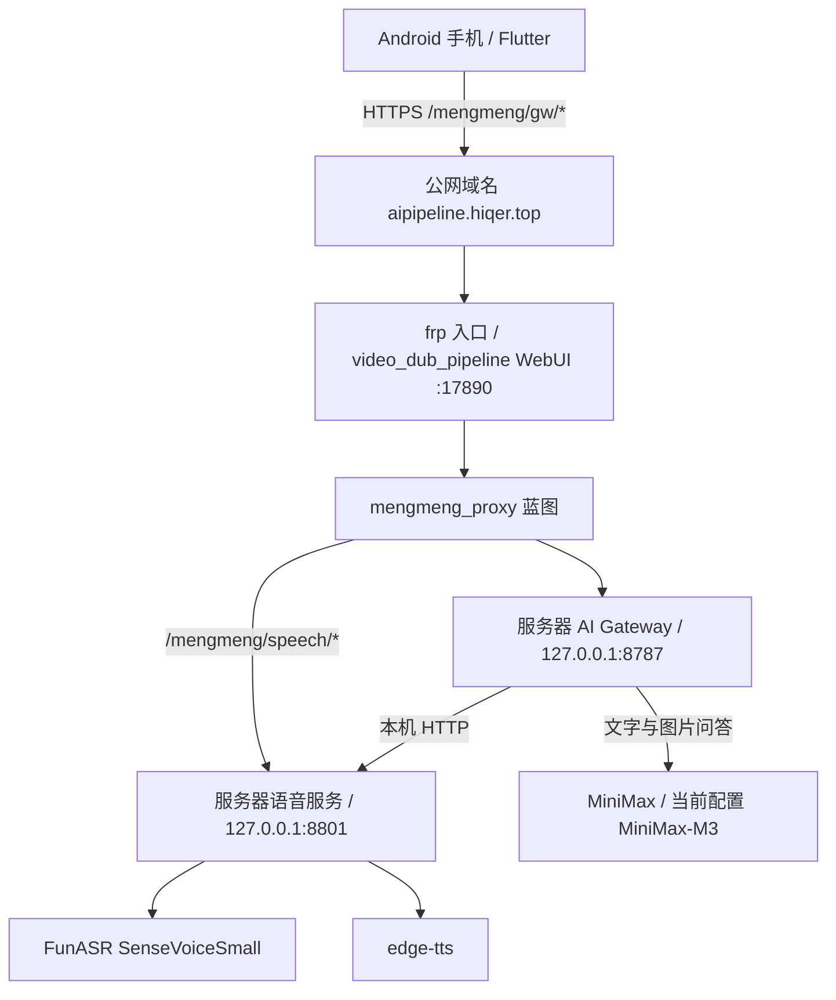
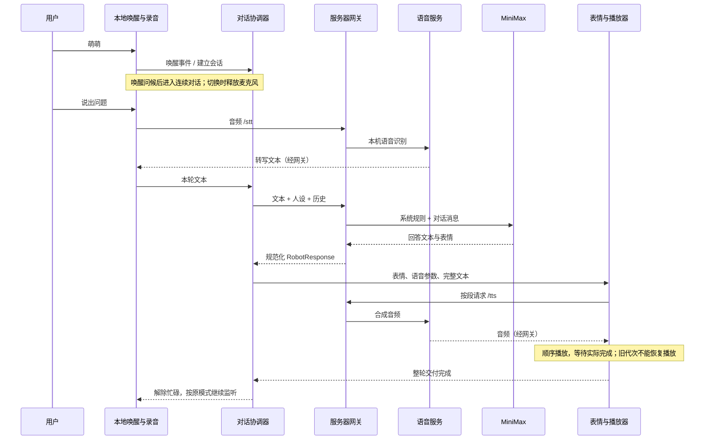
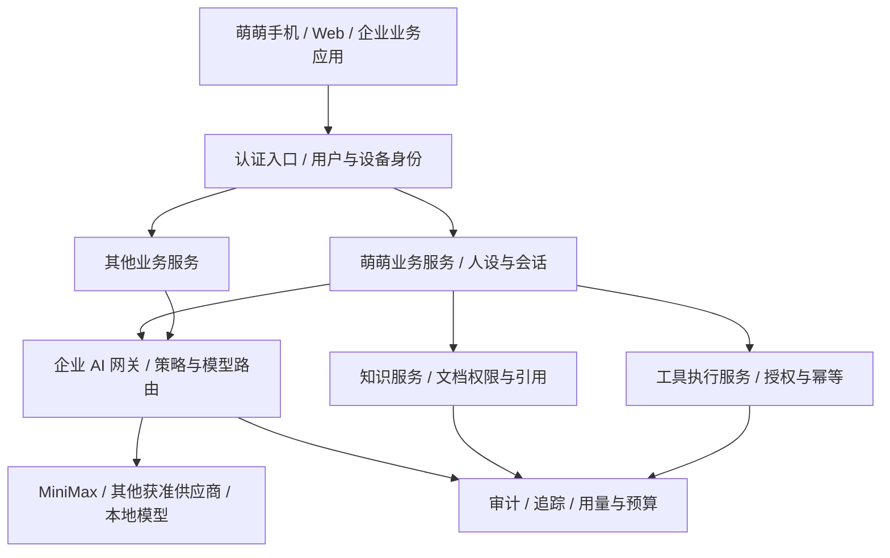

# 萌萌项目：当前架构、功能逻辑与演进规划

> 版本：2026-09-30 · 基于当前工作区代码、服务器部署核对及本次联调记录。  
> 用途：作为产品定位、技术重构和下一阶段立项的共同基线。  
> 状态约定：**已实现**表示存在可执行代码；**已验证**只覆盖注明的测试场景；**待实施**表示规划，不代表现有能力。

## 1. 项目现在是什么

当前项目是一套以 Android 手机为载体的具身陪伴应用：手机承担表情、触摸、传感器、唤醒、摄像头和云台控制；服务器承担对话接入、语音识别与合成；MiniMax 提供文字和图片理解能力。

已经形成的核心体验是：**叫“萌萌” → 听取问题 → 理解并回复 → 同步显示表情 → 播完后继续听**。文字输入、单次语音输入、看图、视觉在场和设备事件围绕这条主线展开。

当前更准确的定位是“具备多模态交互的陪伴终端原型与配套网关”，尚不是完整的个人 AI 操作系统，也不是企业级 AI 网关。

仓库根目录 README 描述了 Local AI Workspace、文档检索、代码代理、内容生成和自动化等更大愿景。它们可以作为未来方向，但当前实际运行的主干是 `pocket_companion/`、`ai_gateway/` 和外部语音服务器。不能根据 README 中的技术列表，认定本项目已经使用 FastAPI、PostgreSQL、Redis、向量数据库或具备 RAG、工具执行、定时任务能力。

### 当前成熟度判断

| 层面 | 当前判断 | 依据与边界 |
|---|---|---|
| 手机陪伴交互 | 已具备可用原型 | 表情、语音、文字、视觉入口及设备反馈已实现 |
| 语音对话 | 基础闭环已打通，稳定性仍需持续验证 | 用户已确认本次真人唤醒“有回应”；断句优化和复杂声学环境验收尚未完成 |
| 多轮上下文 | 已实现并验证基础追问 | 由客户端维护短期历史；不是跨设备、永久记忆 |
| 视觉与云台 | 控制链路已实现，实物体验待补验收 | 有人脸检测及转动回调成功记录；运动方向、稳定性和兼容性不能只凭回调认定 |
| 服务器运行 | 已脱离 Mac | 网关迁至语音服务器，旧 Mac 网关及反向隧道已停用 |
| 多用户产品化 | 待实施 | 无账户体系、租户隔离、配额、完整审计与持久会话 |
| 企业 AI 网关 | 可复用部分基础，但需重新划分边界 | 当前网关包含陪伴业务、人设、情绪和共享状态，不是通用模型治理平台 |

## 2. 当前部署架构

### 部署职责

| 组件 | 实际位置与作用 | 当前运行方式 |
|---|---|---|
| 手机客户端 | Flutter 应用 `pocket_companion/` | 当前主要在华为 P30 Pro / Android 联调 |
| 公网代理 | 服务器 `~/video_dub_pipeline/apps/mengmeng_proxy.py` | 挂载于 WebUI，把公网路径转至本机服务 |
| AI 网关 | 服务器 `~/video_dub_pipeline/services/mengmeng_gateway/` | `systemd --user` 服务 `mengmeng-gateway.service` |
| 语音服务 | 服务器 `~/mengmeng_speech/server.py` | 现有启动脚本与开机任务；独立于网关 |
| 大模型 | MiniMax API | 网关调用；当前统一接入，不做多供应商路由 |
| Mac | 开发、构建和维护终端 | 不再是手机运行链路的必要组成部分 |

网关只监听服务器回环地址 8787，直接访问本机语音服务。语音服务实际监听地址仍为 `0.0.0.0:8801`，WebUI 为 `0.0.0.0:17890`，不应把“网关仅本机监听”理解为所有组件都只对本机开放。

网关已启用自动启动、异常重启和用户 linger。检查时服务器网关源码与本地 `ai_gateway/main.py` 的 SHA-256 一致。当前版本标识为 `20260930-server-boss`。这些是运行与配置验证，不等于已经进行服务器断电重启或长期可用性验收。

### 依赖边界

- 手机需要联网；不需要 USB 连接 Mac，也不需要与 Mac 同一 Wi-Fi。
- 完整对话依赖服务器、公网入口、MiniMax 及相应语音服务可达。
- 本地表情和唤醒不要求每次都能访问模型网关；完整智能回答仍不是离线能力。
- Mac 停止后，公网真实对话已再次验证成功。
- 网关迁移不需要修改手机公网地址或重新安装 APK。

## 3. 代码结构与职责

| 模块 | 主要职责 | 关键文件 |
|---|---|---|
| 应用入口 | 启动与根组件 | `lib/main.dart`、`lib/app/pocket_companion_app.dart` |
| 主页面 | 组合各能力、处理用户操作和生命周期 | `lib/features/face/face_page.dart` |
| 表情系统 | 表情状态、眼睛嘴部动画、触摸反馈、绘制 | `face_controller.dart`、`expression_state.dart`、`painters/robot_face_painter.dart` |
| 对话协调 | 单轮请求与交付、取消、短期历史 | `features/chat/conversation_coordinator.dart`、`conversation_context.dart` |
| 语音协调 | 唤醒模式、连续对话、播报阶段及恢复 | `features/voice/voice_wake_controller.dart` |
| 唤醒检测 | 本地 Sherpa 关键词检测、STT 备用检测 | `sherpa_onnx_wake_detector.dart`、`stt_wake_detector.dart` |
| 识别与播报 | 录音上传、STT、网络与系统 TTS、分段播放 | `speech_service_io.dart`、`tts_service_io.dart`、`tts_chunks.dart` |
| 视觉 | 相机、人脸观测、在场去抖、拍照问答 | `features/vision/face_stream_service_io.dart`、`presence_tracker.dart`、`vision_service_io.dart` |
| 云台 | 跟随控制策略与平台桥接 | `features/gimbal/follow_controller.dart`、`gimbal_service_io.dart` |
| 设备事件 | 电量、充电、加速度与摇晃 | `features/device/device_event_service.dart` |
| 设置与诊断 | 能力开关、语音参数、日志、提示中心 | `features/settings/`、`features/voice/voice_debug_*`、`core/logging/` |
| Android 原生 | AudioRecord 音频采集、平台通道、DJI SDK | `android/app/src/main/kotlin/com/example/pocket_companion/` |
| 网关 | HTTP 接口、模型适配、人设、输出规范化、状态与记忆 | `ai_gateway/main.py` |
| 部署模板 | 加载私有配置、启动与进程恢复 | `deploy/mengmeng_gateway/` |

表中 `lib/` 路径相对于 `pocket_companion/`。Flutter 的平台目录和部分 Web/stub 实现已存在，但不代表 iOS、桌面、Web 的全部能力已经等价验收；Sherpa 原生收音和 DJI 集成以 Android 实现为主。

当前两个明显的职责集中点是 `FacePage` 和 `ai_gateway/main.py`。它们便于快速联调，但 UI、生命周期、业务规则、网络和设备控制耦合较多，后续扩展应逐步拆分。

## 4. 功能清单与真实边界

| 功能 | 当前行为 | 尚未解决或需要注意的边界 |
|---|---|---|
| 萌萌唤醒 | 默认开启；本地 Sherpa 检测，异常时备用 STT | 本次真人唤醒已成功；远场、噪声、长时运行成功率未系统测量 |
| 连续语音对话 | 唤醒后录音、识别、回答，再进入下一轮 | 仍采用能量与静音时间断句；不是自然全双工对话 |
| 单次语音输入 | 录入一句后发送 | 与连续监听做互斥处理，避免两个录音器争用 |
| 文字对话 | 文本请求、显示表情、按设置播报 | 忙碌期间拒绝新轮次，不排队积压 |
| 多轮上下文 | 最近最多 6 轮、总量最多 12,000、单条最多 2,000 | 上述是代码字符长度限制，不是 token 限制；客户端重启不恢复 |
| 多人设 | 萌萌、小远、群群老师；不同语气和音色 | 萌萌、小远当前称呼为“老板”；群群老师保留独立称呼规则 |
| 表情联动 | 文本与 expression 分开，映射眼睛和嘴部动作 | 不是按音素驱动的精准口型同步；模型动作标注需清洗 |
| 完整播报 | 最多 300 个 Unicode 字符分段，按完成事件顺序播完 | 段间可能等待合成；需补长回复真人听感验收 |
| 打断 | 支持主动停止 | 仅凭音量的自动打断默认关闭；回声消除后再考虑恢复 |
| 看一下 | 拍照连同问题发送模型 | 不是连续视频语义理解；图像会离开手机进入模型链路 |
| 视觉守望 | 本地人脸观测形成在场、离开、返回事件 | 人脸检测不等于身份识别，也不是安全监控告警系统 |
| 云台跟随 | 人脸偏差驱动 yaw/pitch 速度，丢失目标后等待或扫描 | OM3 SDK/固件兼容和实际跟踪效果仍需按设备验证 |
| 设备互动 | 摇晃、充电、低电量、触摸影响表达和事件回复 | 部分事件支持模拟；不应把模拟入口等同于真实传感器覆盖 |
| 记忆面板 | 查询、删除网关记忆条目 | 当前是服务器进程内列表，重启丢失，没有用户隔离或向量检索 |
| 隐私与开关 | 控制语音、视觉、记忆；后台暂停与旧任务失效 | 不是企业权限系统，也不等于抹除已经产生的日志 |
| 提示中心 | 右上角未读红点，点开查看操作和错误提示 | 诊断可滚动；仍需改善信息分级和自动问题定位 |

## 5. 主要业务逻辑

### 5.1 一轮语音对话

语音模式分为关闭、唤醒待命、连续对话；录音、请求、播报是执行阶段。模式决定用户意图，阶段决定当前资源占用，不能混为一谈。默认开启也不是不可关闭：用户主动关闭、禁用语音或开启隐私时应尊重相应设置。

本地唤醒已补充真实 PCM 的 RMS/峰值诊断和音频停滞检查。连续三次两秒检查没有有效音频帧会进入恢复流程；这能发现“无数据”，不能独自证明声音质量或关键词准确率。

### 5.2 统一调度与取消

`ConversationCoordinator` 贯穿“请求 → 交付”，交付包括动画更新和播报等待。

- 一次只处理一轮；用户请求遇忙返回 busy，自动事件遇忙丢弃，不积压过期事件。
- 每轮有代次标识；停止、切换会话等操作使旧结果失效。
- 迟到的模型结果或合成音频不能重新触发表情和播报。
- 取消当前交付不一定取消已经发送到服务器或供应商的请求，因此不保证节省模型费用。
- 只有有效、非自动、非规则回退且完成交付的问答才进入短期历史。

这是客户端的对话协调器，尚不是服务器任务调度平台，也没有持久任务队列或跨设备锁。

### 5.3 上下文、记忆和情绪是三种不同数据

| 数据 | 当前所有者 | 生命周期 | 核心限制 |
|---|---|---|---|
| 短期对话上下文 | 手机 ConversationCoordinator | 当前会话内存；关闭、切后台、切换人设或新会话会清理相应历史 | 文本历史；不重复上传历史图片；不跨设备 |
| 记忆条目 | 网关 MemoryManager | 当前进程内存 | 情绪信号等规则性条目；不是完整对话存档，不做向量召回 |
| 情绪/能量/信任等状态 | 网关 EmotionEngine | 当前进程内存 | 规则更新的表现参数，不是对用户真实心理状态的测量 |

网关验证 `context` 的角色、配对、长度与人设一致性，但客户端提供的 `session_id` 只是上下文标识，**不是身份认证凭据**。

关闭 `allow_memory` 不等于关闭短期上下文；隐私模式会限制相关能力。现有日志仍可能记录本轮文本、转写和模型输出，不能把“没有写记忆条目”理解为“没有数据留存”。

### 5.4 模型输出与表达

模型侧主要返回 `text` 和 `expression`；网关负责补齐、限制和规范化完整响应结构，包括声音参数、动画动作和是否播报等。模型输出不直接成为任意设备命令。

已知表情标注如“羞涩微笑”会被分离到动画，而不是交给 TTS 朗读；普通解释文本仍保留。网络合成失败可尝试手机系统 TTS，模型失败可使用规则回复。这些降级保证基础反馈，但不能把规则回复标成一次真实模型成功。

### 5.5 看图、视觉守望与云台跟随

三条逻辑应继续保持独立：

1. **看图问答**：识别“看一下”等意图 → 暂停占用相机的流程 → 拍照 → `/chat/vision` → 回答 → 按当前状态恢复相机流程。
2. **视觉守望**：连续人脸观测 → 去抖和冷却 → 在场/离开/返回事件。主动对话、录音或播报期间不抢答。
3. **云台跟随**：人脸中心偏差 → 死区、比例控制、速度限制 → 原生 DJI 调用；目标丢失后经过保持、扫描、丢失阶段。

跟随闭环在手机执行，不需要每一帧都调用大模型。这个边缘控制原则值得保留：网络负责语义，设备端负责及时、可停止的运动控制。

### 5.6 生命周期与资源占用

相机、麦克风、播放器和云台都有独立异步生命周期。当前已通过互斥、串行启动/释放、代次校验修补多处竞态，但还没有完整抽象出统一资源管理器。

下一步应把“谁拥有麦克风/相机、何时释放、过期回调是否有效”提升为显式规则，减少页面中的分散判断。应用进入后台、隐私开启和主动停止，均应能终止对应资源使用并阻止旧任务复活。

## 6. 网关接口与技术边界

| 接口 | 当前用途 |
|---|---|
| `GET /health` | 网关、识别、模型和播报能力状态 |
| `GET /model/health` | 模型连接诊断 |
| `GET /state` | 当前情绪表现状态 |
| `GET /diagnostics`、`GET /debug/last` | 联调信息与最近请求摘要 |
| `POST /chat` | 文本问答，支持可选 context |
| `POST /chat/vision` | 图片与文本联合问答，支持文本历史 |
| `POST /vision` | 独立图片描述入口 |
| `POST /event` | 唤醒、触摸、设备等事件 |
| `POST /stt` | 原始音频；格式使用 `x-audio-format` 请求头 |
| `POST /tts` | 文本合成音频 |
| `POST /memory/query`、`POST /memory/delete` | 查询和删除进程内记忆 |

还保留了坏 JSON、慢响应等调试入口。当前手机地址为 `https://aipipeline.hiqer.top/mengmeng/gw`，上述路径相对于这一入口。

**当前“网关”更接近陪伴应用后端。** 它使用 Python 标准库 `HTTPServer` 和阻塞调用；长模型请求可能阻塞其他请求。迁移到服务器改善了部署依赖，并没有自动解决并发能力。

`LmStudioClient`、`LMSTUDIO_*` 和响应字段 `model_provider=lmstudio` 是历史命名；实际部署统一调用 MiniMax。后续应在兼容旧接口的前提下改成明确的 provider 配置，避免观测和运维误判。

## 7. 主要架构债务与优先级

| 优先级 | 问题 | 影响 | 建议 |
|---|---|---|---|
| P0 | 断句仍依赖能量与固定静音时间 | 停顿被误判、短语丢失、对话不自然 | 单一采集流、开头缓冲、VAD 与等待续说阶段；按实机语料评估 |
| P0 | 缺少系统性语音验收数据 | 单次成功不能证明持续可用 | 建立距离、噪声、语速、横竖屏、重连与长回复样本矩阵 |
| P0（扩大使用前） | 公网缺少应用层身份与访问控制 | 入口可被滥用；调试和记忆接口有数据风险 | 设备注册/认证、入口访问策略、关闭公开调试接口、日志脱敏 |
| P0（多设备前） | 进程全局 EmotionEngine、MemoryManager、last_stt_result、last_debug | 多设备串状态；旧客户端空文本恢复可能取到另一设备转写 | 显式用户/设备/会话作用域；删除或严格限定全局恢复机制 |
| P1 | 单线程、阻塞式 HTTP 服务 | 慢请求拖住健康检查及其他设备 | 有界并发、超时预算、请求取消与服务拆分；先隔离状态再增加并发 |
| P1 | 对话全量返回、TTS 逐段现合成 | 首次回复和段间停顿 | 流式文本、按句合成、有限预取、严格顺序与取消 |
| P1 | FacePage 与网关单文件职责过多 | 修改容易破坏相邻能力 | 分离控制器、业务服务、模型适配器和协议层 |
| P1 | 内存记忆被误认为长期记忆 | 重启丢失；权限与删除语义不清 | 分离历史、偏好、事实、调试数据；明确保存策略后持久化 |
| P1 | 健康检查与实际可用性不完全等价 | 显示健康但用户仍无法完成任务 | 区分存活、就绪、依赖探测和合成事务；不把系统 TTS 回退等同网络 TTS 成功 |
| P2 | 部署与文档分散 | 容易读到旧 IP、旧 Mac 链路或过时能力描述 | 统一部署清单、版本、配置模板、变更与回滚记录 |
| P2 | 多平台目录存在但能力不齐 | 发布预期不一致 | 能力矩阵与平台验收；避免一次承诺所有平台 |

公网与多租户问题是“扩大使用前”的门槛，不代表必须暂停当前单用户体验迭代。它们应与语音稳定性并行推进，但不应通过新增并发来放大全局共享状态的问题。

## 8. 可选演进方向

### 方向 A：稳定、自然的个人陪伴终端

**目标用户与价值**：需要桌面陪伴、语音交流和轻量信息问答的个人用户。主要优势是低操作负担、表情与自然交互，不以连接更多工具为第一目标。

**可复用基础**：人设、唤醒、表情、单轮调度、语音和本地视觉。

**最小下一版本**：可靠唤醒与断句、完整长回复、明确停止、网络异常恢复、偏好记忆可查看和删除。优先解决自然说话体验，再扩展主动提醒、日常回顾等功能。

**验证方式**：连续追问完成率、错误断句率、用户主动停止成功率、每小时误唤醒数、长回复完整率。主动互动还应衡量打扰次数，而不只统计互动总量。

### 方向 B：具身视觉助手与可替换硬件终端

**目标场景**：桌面跟随、视频互动、展示讲解、轻量导览。先选择一个明确场景，避免把人脸跟随直接包装成通用机器人。

**可复用基础**：相机观测、在场状态、表情和云台控制闭环。

**最小下一版本**：定义通用云台能力接口，保留 DJI 适配器；完成设备方向标定、速度上限、目标丢失停止和断连处理。之后才考虑不同执行器、外接摄像头或独立终端。

**验证方式**：跟随误差、停止时延、目标丢失行为、运行温度与耗电；测试结果必须包含实物运动，不能只记录 SDK 返回成功。

### 方向 C：连接企业 AI 网关的语音与视觉入口

**目标场景**：企业知识问答、设备操作说明、会议室或工位助手。萌萌作为交互终端，企业平台负责身份、权限、模型、知识与工具。

**可复用基础**：手机交互、结构化表达、会话协议、语音服务和模型适配经验。

**最小下一版本**：企业登录或设备身份、一个受控模型入口、一个有权限过滤的知识源、答案引用、审计和预算。默认只做查询，不开放任意业务写操作。

这是企业方向中更适合先验证的路径：先证明语音终端能让真实业务更高效，再决定是否自建企业网关底座。详见下一节。

### 方向 D：私有部署与边缘离线能力

**目标场景**：对断网可用性、数据流向或成本有明确约束的个人与组织。

**可复用基础**：本地唤醒、手机视觉、服务器本地 STT、模型服务接口。

**最小下一版本**：有限离线指令集、清晰的在线/离线状态、可配置的本地模型适配器、按数据类型选择是否允许云端处理。

**关键取舍**：当前“服务器在自己设备上”不等于“全链路离线”——MiniMax 和 edge-tts 仍属于网络依赖。应先测目标硬件上的时延、资源与回答质量，再决定替换哪些组件，不预设某个模型能达到云端同等表现。

### 方向 E：可控的技能与工作流平台

**目标场景**：查询日程、生成摘要、触发受控业务流程等跨应用任务。

**可复用基础**：输入意图、会话协调和结构化输出；现有协调器只能作为交互前端，不是完整任务引擎。

**最小下一版本**：技能注册、输入输出 schema、权限、执行超时、幂等标识和结果回传；选择一个只读技能先做闭环，再添加需要确认的写操作。

**关键边界**：模型负责提出调用意图，执行器负责核验权限和执行；不允许模型直接生成任意 shell、数据库语句或设备控制命令后无条件执行。

### 方向比较

| 方向 | 与当前能力的接近程度 | 新增的主要门槛 | 建议启动条件 |
|---|---|---|---|
| A 个人陪伴 | 高 | 声学体验、持续稳定性、产品细节 | 立即作为主线 |
| B 具身硬件 | 高，但实物验收不足 | 设备适配、标定与安全停止 | 当前云台稳定验收后 |
| C 企业入口 | 中 | 身份、权限、知识与治理接入 | 有真实试点业务和数据负责人 |
| D 私有/离线 | 中 | 算力、模型质量、端侧资源管理 | 有明确离线或数据边界需求 |
| E 技能工作流 | 中低 | 工具执行、授权、幂等、长任务 | 会话与身份边界稳定后 |

建议以 A 为体验主线，以 C 做一个受控试点；B、D、E 按真实需求触发，不在同一阶段全面铺开。

## 9. 企业 AI 网关方向的具体规划

### 9.1 先区分“接入企业网关”和“建设企业网关”

| 路径 | 项目承担什么 | 优点 | 代价与适用条件 |
|---|---|---|---|
| 接入已有企业网关 | 交互终端 + 陪伴/助手业务后端 | 较快复用统一身份、模型与审计 | 需适配已有协议；企业已具备网关时优先考虑 |
| 提炼独立企业网关 | 通用模型接入与治理平台，萌萌成为其中一个应用 | 可服务其他 App 和业务系统 | 产品范围大，需要稳定团队和多应用需求 |
| 保持单应用后端 | 继续聚焦个人/单组织场景 | 改造较小，体验推进快 | 不能对外宣称通用企业治理能力 |

**建议**：先完成通用边界拆分，支持接入企业现有网关；在至少出现两个独立应用的共同需求后，再考虑把治理层建设成单独产品。不要把“当前文件名叫 ai_gateway”作为自建平台的充分理由。

### 9.2 建议目标结构（待实施）

语音服务保留独立接口，可由萌萌业务服务接入。RAG 和业务工具不必全部塞进模型网关：网关管理模型访问策略，知识服务管理文档检索与权限，工具服务管理动作执行。

### 9.3 企业网关需要补齐的能力

| 能力 | 当前可复用部分 | 必须新增的设计 |
|---|---|---|
| 模型适配 | 单一 MiniMax 调用和输出规范化 | provider 接口、能力声明、模型配置与版本；按文本/图像等能力路由 |
| 身份与隔离 | 人设与 session_id 字段 | 已认证主体、tenant/user/device/session 作用域；租户从认证结果确定，不信任请求自报 |
| 密钥管理 | 服务端环境配置、不放手机 | 按租户或应用授权使用供应商凭据、轮换和最小可见范围 |
| 权限策略 | 客户端功能开关 | 服务端强制策略；客户端不能自行提升权限 |
| 限流与预算 | 基本超时 | 应用/租户并发上限、用量归属、预算阈值、超限行为 |
| 稳定性 | 规则降级与健康接口 | 分层超时、熔断、有限重试、背压；禁止重试导致重复业务动作 |
| 观测与审计 | 调试日志、模型字段 | 贯穿端到端的 trace_id/turn_id、耗时拆分、脱敏、保留周期和访问控制 |
| 数据治理 | 隐私开关、记忆删除入口 | 持久数据分类、所属主体、保存/删除策略、导出与访问记录 |
| RAG | 当前无正式实现 | 文档接入、切分、版本、权限过滤、引用与回答质量评估 |
| 工具治理 | 当前无通用执行层 | 工具白名单、参数校验、用户授权、写操作确认、结果与副作用记录 |
| 流式协议 | 当前整包请求/响应 | 版本化事件、完成/取消语义、断线行为和兼容策略 |

工具调用的权限与确认建议参考 OWASP 对过度代理能力的分析，但具体实现应由业务动作风险决定，不能只依赖模型自我约束。[参考：OWASP Excessive Agency](https://genai.owasp.org/llmrisk/llm062025-excessive-agency/)

观测可以借鉴 OpenTelemetry 的统一语义约定；实施时固定协议版本并保留映射，避免遥测字段随依赖升级漂移。这里是候选方案，不表示当前已经接入。[参考：OpenTelemetry Semantic Conventions](https://opentelemetry.io/docs/concepts/semantic-conventions/)

企业试点应明确用途、责任人、评价方法和剩余风险；可以用 NIST AI RMF 组织这些工作，但框架本身不是“系统已经合规”的证明。[参考：NIST AI RMF](https://www.nist.gov/itl/ai-risk-management-framework)

### 9.4 最小企业试点

推荐从“受权限约束的内部操作手册问答”开始：一个组织、一个明确文档范围、一个模型入口、文字与语音两种输入；回答必须带来源，找不到证据时明确说明。

验收至少包括：不同身份看到不同文档、无权限资料不能通过追问泄漏、用量可归属、请求可以追踪、错误可定位、会话不会串到其他设备。涉及文档中的恶意指令时，系统应把它当作被检索内容，而不是执行授权。

首版不承诺通用办公代理、任意插件市场、自动修改生产系统、全面多模型智能路由或复杂跨区域部署。先验证真实业务价值和边界，再扩展平台范围。

## 10. 分阶段路线与验收门槛

以下是建议实施顺序，不是已经排定的工期。每阶段根据上一阶段结果决定是否继续。

| 阶段 | 主要交付 | 完成门槛 |
|---|---|---|
| 阶段 0：稳定当前闭环 | 唤醒/断句样本集、长播报验收、资源占用诊断、部署基线 | 连续对话、主动停止、前后台恢复、断网恢复和长回复有可复现结果 |
| 阶段 1：拆清基础边界 | App 交互协调与资源管理分离；网关路由/业务/模型/状态分离；身份与状态作用域 | 至少双设备不串上下文、转写、情绪和记忆；旧手机接口兼容 |
| 阶段 2：提升实时体验 | 流式文本、语句级合成、有限预取；VAD 与等待续说 | 首次可听回复、错误截断、段间停顿均有对照数据；取消不播放旧音频 |
| 阶段 3：企业受控试点 | 接入企业身份/网关、单一权限知识源、引用、审计与预算 | 权限与串租户测试通过；业务负责人认可答案质量和实际价值 |
| 阶段 4：按需求产品化 | 选择硬件扩展、离线部署、技能平台或独立企业网关 | 明确用户、部署形态、运营责任和可维护范围，不盲目扩张 |

### 优先实施的具体事项

1. 完成正在规划的断句改造：开头缓冲、等待续说、统一收音所有权；用同一组录音/真人场景对比前后效果。
2. 建立完整语音验收矩阵，并把用户已确认的“本次唤醒有回应”记录为单次成功，而不是整体结项。
3. 分离“处理一次回答”和“占用麦克风/相机/播放器”的状态，减少 FacePage 中的生命周期分支。
4. 在支持多设备前，移除网关全局转写恢复和共享业务状态风险，加入身份与请求作用域。
5. 收敛公网接口，明确调试接口是否开放、谁能查询记忆、日志保留哪些内容。
6. 把 MiniMax 适配从历史 LM Studio 命名中提取出来，保留协议兼容层。
7. 选择一个真实企业试点，先确认现有企业网关能复用什么，再决定自建范围。

## 11. 验证指标与已知证据

### 当前证据

- 最近一轮语音修复：151 项 Flutter 测试通过；静态检查及 Android debug 构建通过。此处引用此前验证记录，本次文档工作未重跑全套测试。
- 网关：13 项 Python 测试通过；本次迁移在服务器执行过测试。
- 用户已确认最新版本呼叫“萌萌”有回应；连续追问、不同环境唤醒率、长回复完整听感仍需进一步验收。
- 公网迁移验收：TTS 返回音频，STT 识别“老板服务器迁移测试成功”，MiniMax 追问正确回忆“蓝鲸四十七”。Mac 网关与隧道停用后，真实对话仍成功。
- 云台有检测到人脸与 SDK 转动成功回调记录，尚不据此承诺所有姿态和设备环境下稳定跟随。
- 本次只读部署检查确认：网关服务 active/enabled、Linger=yes、本地与服务器网关源码一致，18787 旧隧道端口未出现在检查结果中。

### 下一阶段应持续记录的指标

| 维度 | 建议指标 | 测量要求 |
|---|---|---|
| 唤醒 | 成功率、每小时误唤醒、呼叫到反馈时延 | 按距离、噪声、语速和设备分别统计 |
| 断句 | 提前截断率、错误合并率、首字丢失率 | 使用固定语料和带停顿的真人任务 |
| 对话 | 两轮/多轮任务完成率、历史引用正确率 | 区分模型成功、规则回退和网络错误 |
| 播报 | 完整播放率、首音时延、段间停顿 | 同时记录主动停止，不能算作失败截断 |
| 资源 | 麦克风/相机占用异常、耗电、温度 | 包含前后台切换和长时间运行 |
| 服务 | 分阶段 P50/P95 延迟、错误率、重启恢复时长 | 分开 STT、模型、TTS、网络和设备播放 |
| 企业 | 身份隔离、权限过滤、请求可追踪、用量归属 | 必须加入越权与交叉会话测试 |

暂不把任意数字写成现有服务承诺。先采集基线，再与目标用户确定可接受阈值；隔离错误、未授权操作和旧任务复活则应作为必须阻断的缺陷。

## 12. 决策建议

推荐保留“手机端负责交互与实时控制，服务端负责语义与策略”的总体分工，继续以稳定的语音陪伴体验作为主线。

近期价值最高的工作是断句与完整对话验收、资源生命周期收敛，以及多设备前的身份/状态隔离。企业 AI 网关方向值得推进，但更适合作为独立、有明确业务试点的演进分支：先让萌萌成为企业平台的一个可靠入口，再决定是否把通用网关建设成单独产品。

### 后续立项需要明确的选择

- 首个主要用户是个人、团队内部，还是对外客户？
- 是否已有企业模型网关、统一登录和知识平台可以复用？
- 哪些数据允许发往云模型，哪些只能保留在组织内部？
- 是否真的需要离线运行、多个硬件终端或写入业务系统？
- 谁负责服务器、模型费用、数据保留和故障处理？

这些选择影响产品范围与架构优先级，应在大规模引入新组件之前明确。

## 13. 依据与维护入口

### 当前实现与部署

- [对话协调器](../pocket_companion/lib/features/chat/conversation_coordinator.dart)
- [语音状态与调度](../pocket_companion/lib/features/voice/voice_wake_controller.dart)
- [本地唤醒检测](../pocket_companion/lib/features/voice/sherpa_onnx_wake_detector.dart)
- [播报生命周期](../pocket_companion/lib/features/voice/tts_service_io.dart)
- [视觉在场状态](../pocket_companion/lib/features/vision/presence_tracker.dart)
- [云台跟随策略](../pocket_companion/lib/features/gimbal/follow_controller.dart)
- [网关实现](../ai_gateway/main.py)
- [服务器服务模板](../deploy/mengmeng_gateway/mengmeng-gateway.service)

### 已有专题资料

- [当前部署与迁移记录](speech_and_domain_architecture.md)
- [对话重构与多轮上下文](conversation_redesign.md)
- [断句与完整播报方案](voice_turn_redesign.md)
- [唤醒联调记录](voice_wake_progress.md)
- [视觉与云台联调记录](gimbal_follow_progress.md)
- [早期完整产品设想](../Doc/手机具身情感聊天机器人完整开发文档_V1.4.md)

阅读历史资料时，以当前源码、当前部署和较新的验证记录为准；“已规划”“接口返回成功”“单次真人成功”“持续可靠”是四种不同结论，应分别记录。
